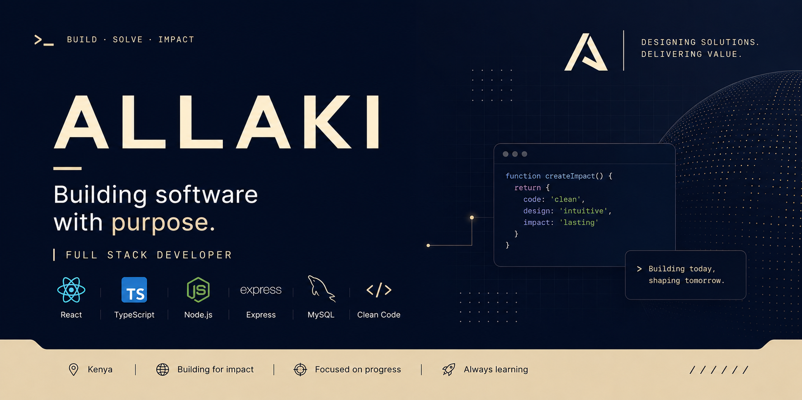

  

# Hi, I'm Alvin Langat.

I'm a full stack developer focused on building modern software that balances thoughtful design, clean architecture, and real-world usability.

I enjoy turning complex business workflows into intuitive digital experiences while continuously refining performance, maintainability, and user experience.

## About

- Building **SmartBizzSystem**
- Passionate about scalable software architecture
- Focused on modern UI/UX
- Writing clean, maintainable TypeScript
- Always improving one project at a time

## Currently Building

### SmartBizzSystem

A modern business management platform focused on speed, usability, and scalability.

Current modules include:

- Dashboard
- Customers
- Inventory
- Sales
- Suppliers
- Reports
- Authentication
- Point of Sale
- Settings

## Tech Stack

## GitHub Analytics

## Contribution Activity

## GitHub Analytics

  
  

  

## Contribution Activity

  

## Development Metrics

  

## Contribution Snake

  

