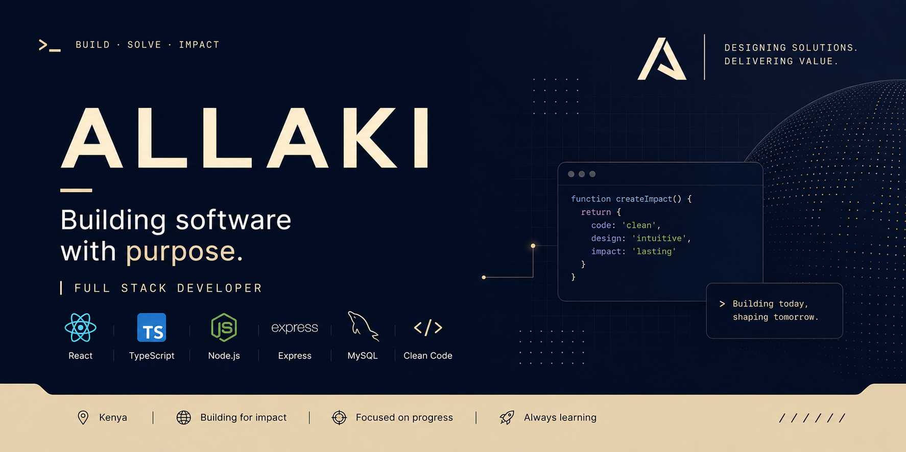

  

# Hi, I'm Alvin Langat.

I'm a developer focused on building modern software that balances thoughtful design, clean architecture, and real-world usability.

I enjoy turning complex business workflows into intuitive digital experiences while continuously refining performance, maintainability, and user experience.

## About

- Building **SmartBizzSystem**
- Passionate about scalable software architecture
- Focused on modern UI/UX
- Writing clean, maintainable TypeScript
- Always improving one project at a time

## Currently Building

### SmartBizzSystem

A modern business management platform focused on speed, usability, and scalability.

Current modules include:

- Dashboard
- Customers
- Inventory
- Sales
- Suppliers
- Reports
- Authentication
- Point of Sale
- Settings

## Tech Stack

### Frontend

  
  
  
  
  
  
  

**Libraries:** Recharts • jsPDF • SheetJS (xlsx)

---

### Backend

  
  
  

**Authentication:** JWT • bcrypt

---

### Database

  

**Hosting:** Neon PostgreSQL

---

### Deployment

  
  

---

### Tools

  
  
  
  
  

---

# GitHub Analytics

---

# Contribution Activity

---

# Contribution Snake

---

## Featured Project

### SmartBizzSystem

A scalable business management platform designed to streamline business operations through modern architecture and an intuitive user experience.

---

# Developer Insights

---

© 2026–Present KAL

